# Table of Contents
[Overview](#Overview)  
[Software Packages](#Software-Packages)  
[Hardware List](#Hardware-List)  
[Launching the System](#Launching-the-System)  
[Wiring from Robot Servos to Arduino](#Wiring-from-Robot-Servos-to-Arduino)  
[Motor Calibration](#Motor-Calibration)  
[Inverse Kinematics](#Inverse-Kinematics)  
[Coordinate Systems](#Coordinate-Systems)  
[Finding the Intrinsic Camera Matrix](#Finding-the-Intrinsic-Camera-Matrix)  
[Communication between Arduino and Computer through USB](#Communication-between-Arduino-and-Computer-through-USB)

# Overview
In this project, a robot arm stretches out to chase a laser dot. The project involves building a 3-DOF arm, performing inverse kinematics, controlling the arm with Arduino and ROS, processing the webcam video using OpenCV functions such as perspective transform, and calculating the laser position relative to the arm using intrinsic camera matrix and transformation matrices. 

See [YouTube Demo](https://youtu.be/46Q9ypHZdVk)

Here is a picture showing the interaction between the hardware and the software:
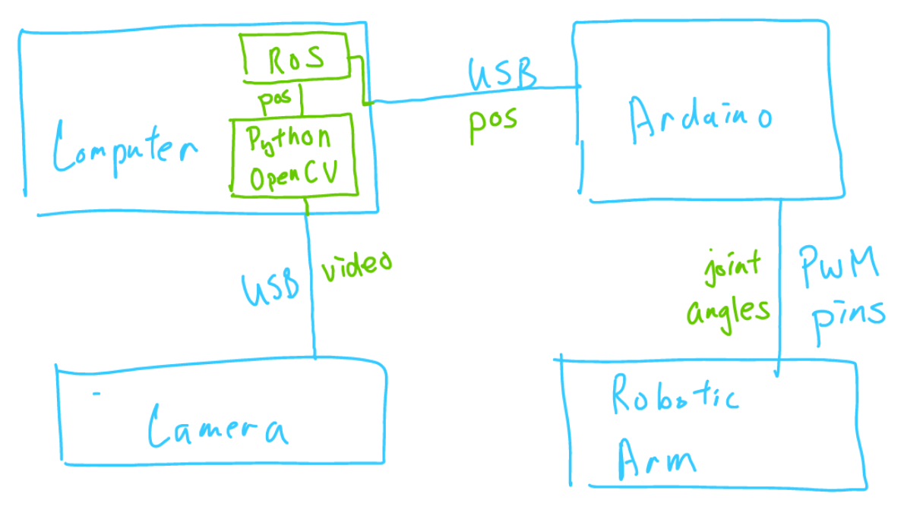

Here is a picture showing what the actual setup looks like:
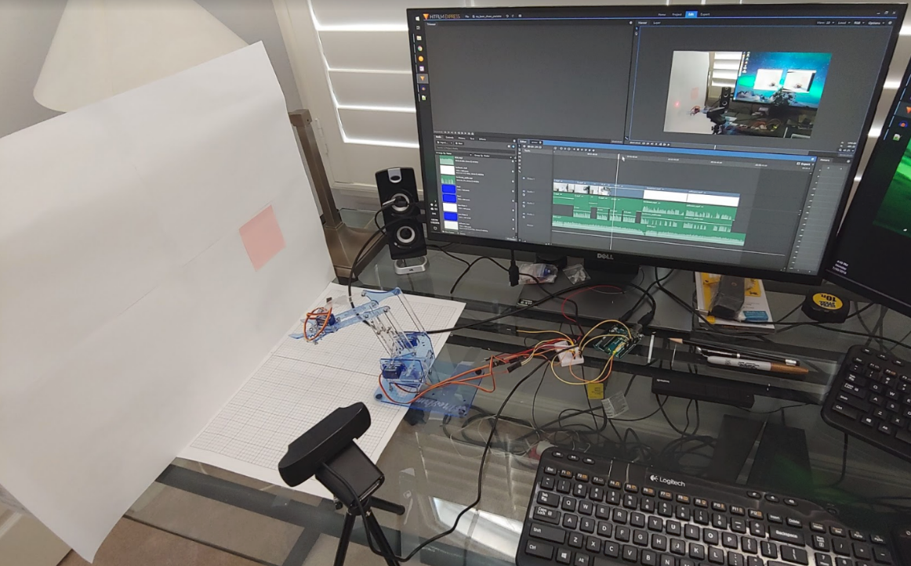

# Software Packages
ROS Kinetic Kame  
Arduino IDE  
opencv-python (3.4.1.15)  
numpy (1.15.4)  

# Hardware List
Arduino Uno R3  
Breadboard and Jumper Wires  
MeArm Robot Arm  
Logitech HD Pro Webcam C920  
Mini Webcam Tripod for Logitech Webcam C920  
Laser Pointer  
Computer (running Ubuntu 16.04)  

# Launching the System
After everything is setup, run the following commands:

- Terminal 1
    - `roscore`
- Termainl 2
    - `cd pos_publisher`
    - `python pos_publisher.py`
- Then run main_arduino/main_arduino.ino and upload the sketch to Arduino
- Terminal 3
    - `rosrun rosserial_python serial_node.py /dev/ttyACM0`
    - Note that the port name could be ttyACM1, ttyACM2, etc.)

# Wiring from Robot Servos to Arduino
The file main_arduino/configuration.h has variables that depends on which pins are connected to which servos. If you don't want to change those variables, wire the servos to the pins in the following way:

- 5: Base
- 6: Shoulder
- 9: Elbow
- 10: Gripper

# Motor Calibration
The servos are controlled by PWM values in Arduino. Since <Servo.h> library is used, the servo values range from 0 to 180. However, when deriving the kinematics equations, we need to assign an angle convention to each servo. The angle convention does not need to match up with the PWM values. Therefore, motor calibration is needed to convert between them.

The file main_arduino/configuration.h contains the parameters for the conversion. Note that the parameters are named with “MAX” and “MIN”, but they aren’t really maximum and minimum because the servos will still go beyond these values if you command them. It is better to think of the “MAX” and the “MIN”  as “Position 1” and “Position 2”.

The following picture shows the angle convention for each servo (Base, Shoulder, and Elbow):
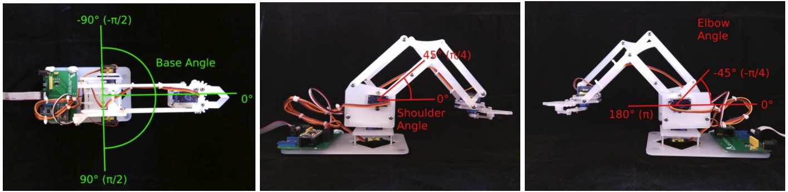

The following picture shows how the parameters in configuration.h is determined:
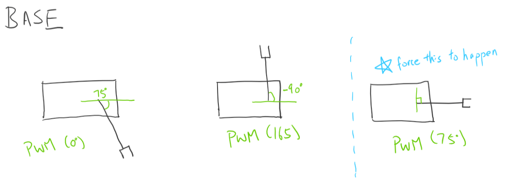
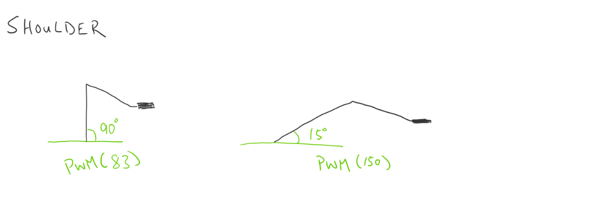
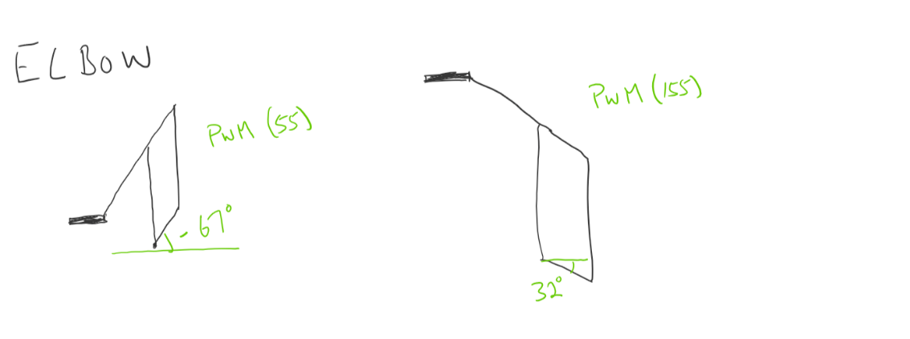

# Inverse Kinematics
The code in main_arduino/ik.cpp does the inverse kinematics slightly differently, but the concept is the same.

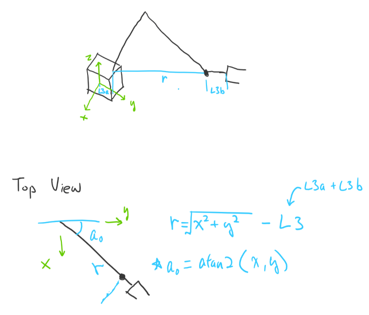
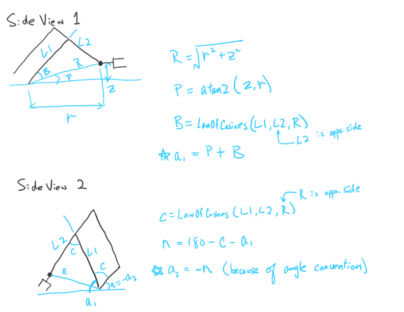

# Coordinate Systems
The laser location is transformed to different coordinate systems (CS) throughout the code. Here is the process and see figure below for clarification:
1. The actual camera receives an image and perspective transform is applied to it
2. The image is currently in the red CS
3. With OpenCV functions, the laser location is obtained in the red CS
4. With intrinsic camera matrix, the laser location is transformed to the purple CS
5. With 4x4 transformation matrix, the laser location is transformed to the green CS
6. With another 4x4 transformation matrix, the laser location is transformed to the blue CS
7. Since the blue grid tells us where the robot is reachable, the laser position is projected towards the negative z direction until a reachable position is found.
8. If there is a reachable position, it is then transformed to the green CS and published to a ROS topic.
9. Now the Arduino will pick up the reachable position, perform inverse kinematics, and control the servos

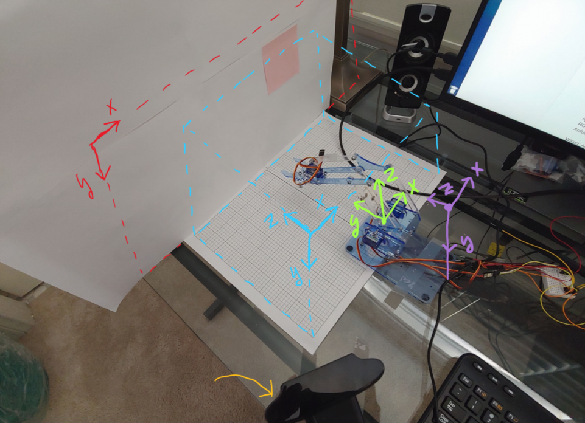
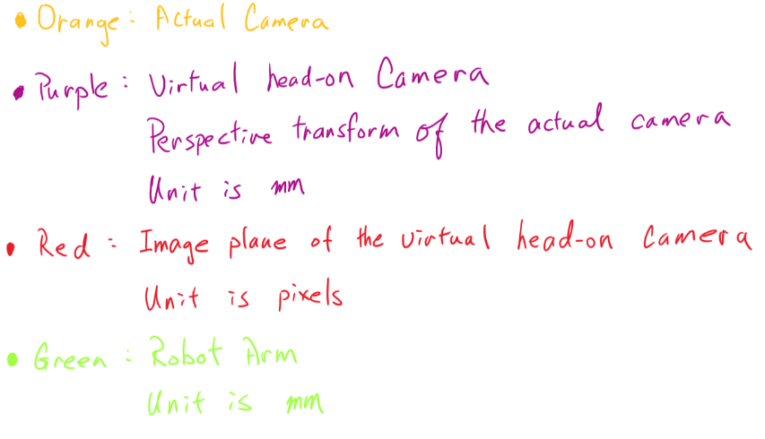
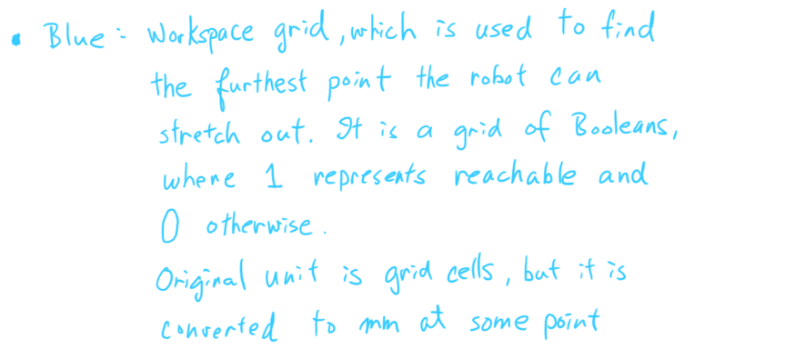

# Finding the Intrinsic Camera Matrix
A ROS package called [camera_calibrator](http://wiki.ros.org/camera_calibration#Camera_Calibrator) is used to find the intrinsic camera matrix

The matrix can be used to map 3D points in the world to 2D points in an image (or vice versa).
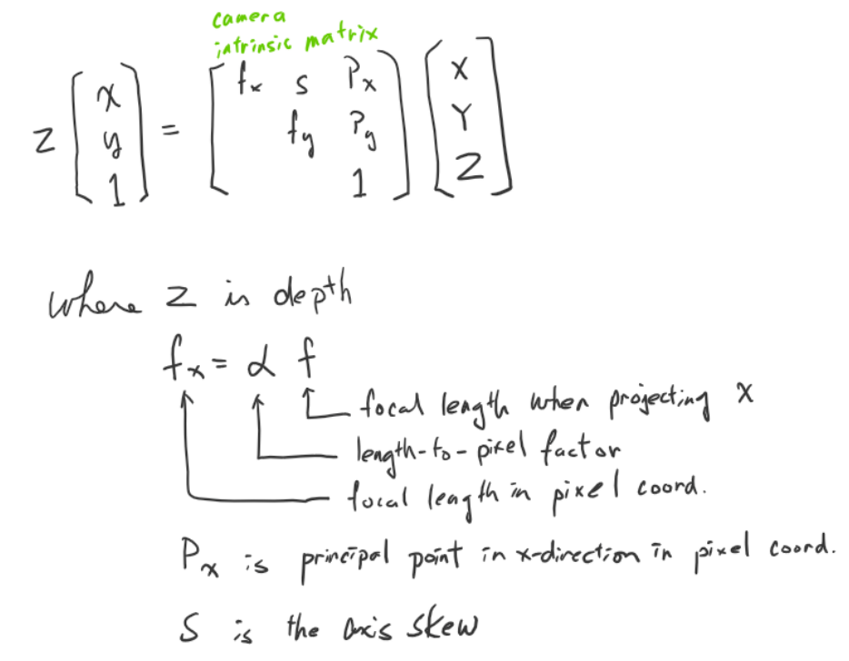
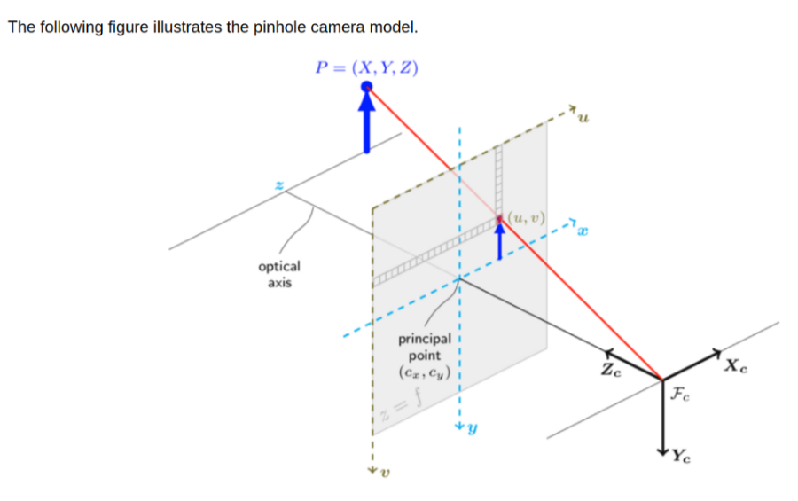

# Communication between Arduino and Computer through USB
ROS and Arduino through rosserial  
http://wiki.ros.org/rosserial_arduino/Tutorials

Permanently set USB device to have read and write access  
http://ask.xmodulo.com/change-usb-device-permission-linux.html

Temporarily set USB device to have read/write access  
sudo chmod a+rw /dev/ttyACM0

Change USB settings (number of subscribers/publishers and input/output buffers)
- http://wiki.ros.org/rosserial_arduino/Tutorials/NodeHandle%20and%20ArduinoHardware
- Note that an empty file called ros_empty.h needs to be created in the ros_lib folder
- in the newly created ros.h file, add #include <ros_empty.h>
- #include <foo/foo.h> does not work if foo is in the libraries file for some unknown reason.
- in the newly created ArduinoHardware.h, change &Serial1 to &Serial
