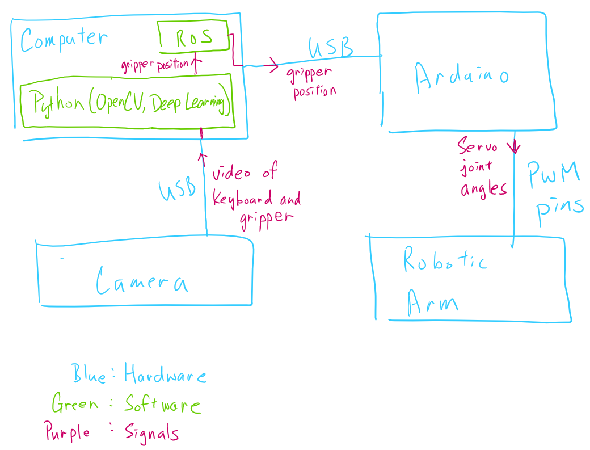
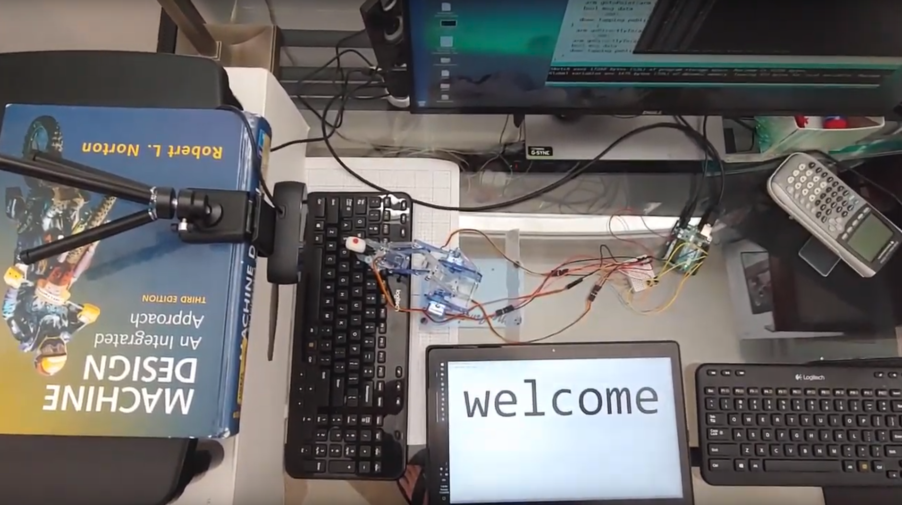
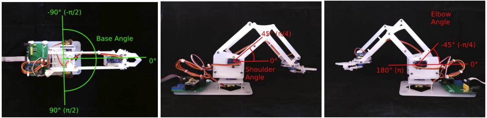
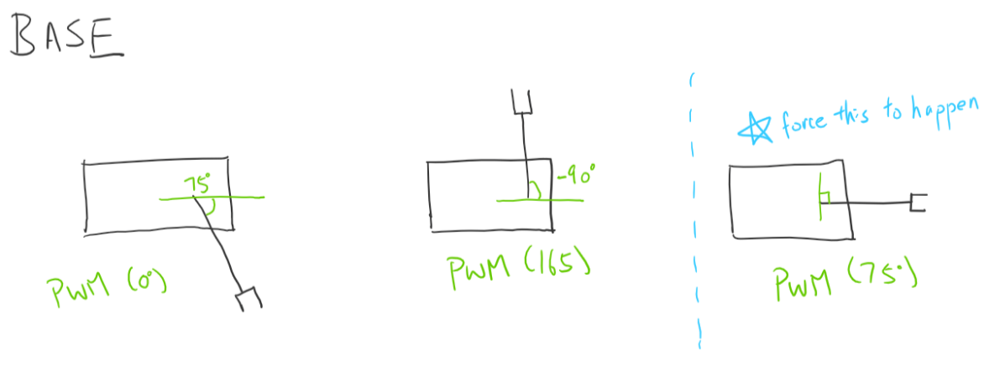
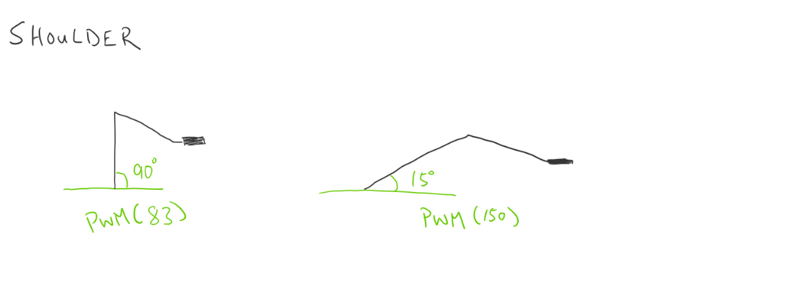
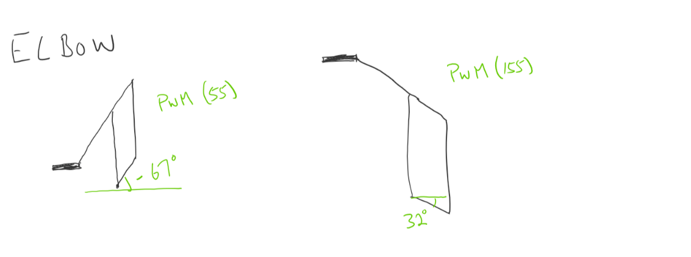
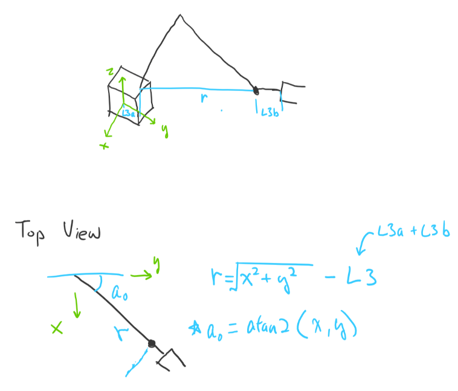
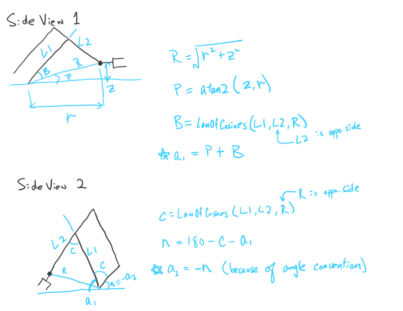
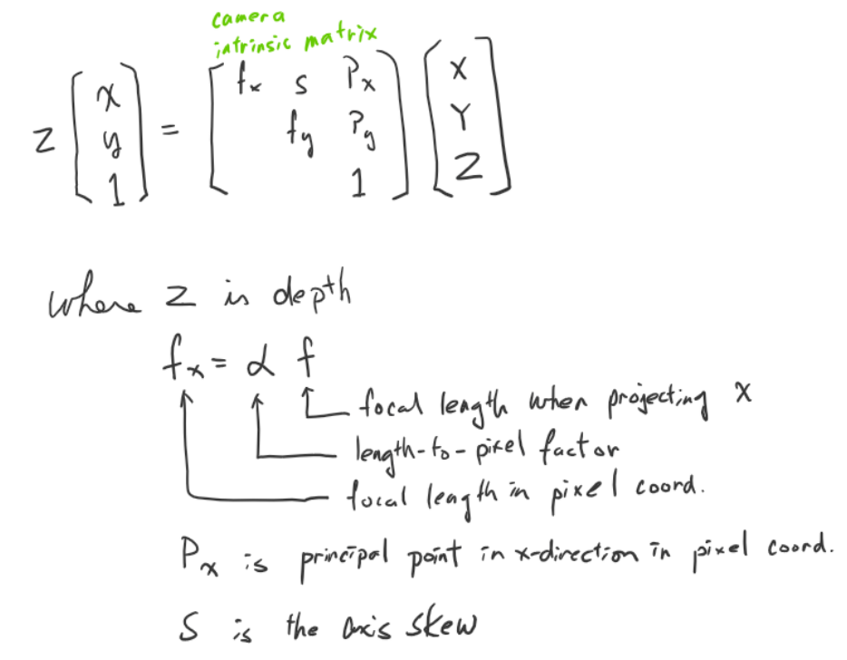
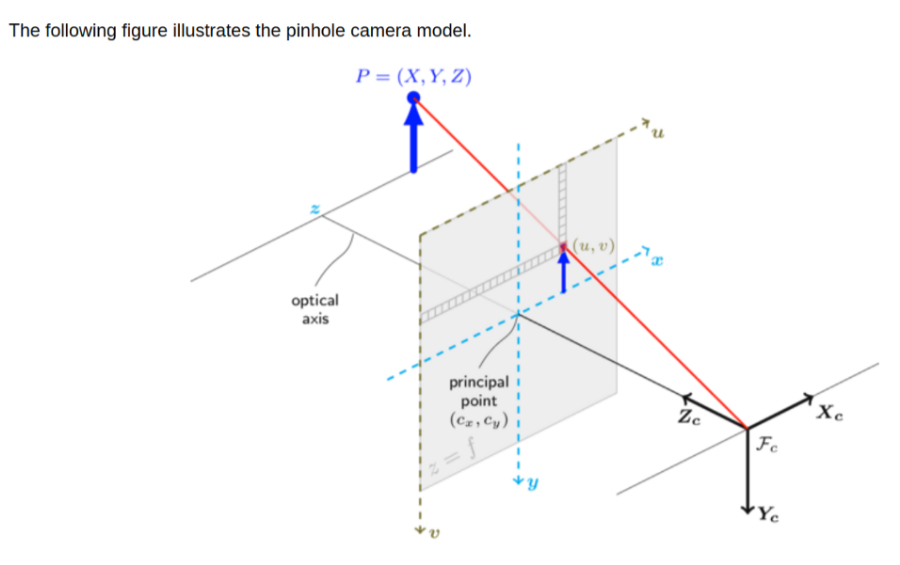

# Table of Contents
[Overview](#Overview)  
[Software Packages](#Software-Packages)  
[Hardware List](#Hardware-List)  
[Pipeline](#Pipeline)  
[Wiring from Robot Servos to Arduino](#Wiring-from-Robot-Servos-to-Arduino)  
[Motor Calibration](#Motor-Calibration)  
[Inverse Kinematics](#Inverse-Kinematics)   
[Finding the Intrinsic Camera Matrix](#Finding-the-Intrinsic-Camera-Matrix)  
[Communication between Arduino and Computer through USB](#Communication-between-Arduino-and-Computer-through-USB)

# Overview
In this project, letters on a keyboard are detected and located, then a robot arm moves to corresponding letters to type out a word from user input.

Deep Learning is applied to detect and locate the keyboard letters. A convolutional neural network is built and trained from scratch. A Python script is written to generate thousands of training images. Data augmentation is used to further diversify the data. OpenCV is used to locate the robot arm and find the regions of interest that will be fed into the neural net. Finally, the Arduino receives the location information through ROS and commands the robot arm to move to the keys using a closed-loop control.

See [YouTube Demo](https://youtu.be/I7_Z-FtJ_zA)

Here is a picture showing the interaction between the hardware and the software:

Here is a picture showing what the actual setup looks like:

# Software Packages
ROS Kinetic Kame  
Arduino IDE  
opencv-python (3.4.1.15)  
numpy (1.15.4)  
tensorflow-gpu (1.12.0)
keras (2.2.4)
scikit-learn (0.18.1)
pandas (0.17.1)
jupyter notebook

# Hardware List
Arduino Uno R3  
Breadboard and Jumper Wires  
MeArm Robot Arm  
Logitech HD Pro Webcam C920   
Computer with Nvidia GPU GTX1080 (running Ubuntu 16.04)
Keyboard
InstaMorph Moldable Plastic

# Pipeline
## 1. Generating Training Images  
In the _char_gen_ folder, char_generator.py creates training images. You can customize the characteristics of the training images such as font size, image size, background brightness, etc. The python file looks inside the _font_ folder and creates images of all font styles within it.

The generated images will be in the _generated_char_ folder. Now you need to split the data into a training set and a validation set. Use split_data.py to perform splitting and the resulting images will be in the _generated_char_split_ folder.

## 2. Training the Neural net
In the _neural_net_training_ folder, open NN_training.ipynb in jupyter notebook. The notebook extracts the training images, builds a neural net, and performs training. The resulting neural net model will be saved in the _saved_models_ folder.

## 3. Project Execution
### 3.1 main/main1.py
This python file loads the trained neural net model, detects and locates keyboard letters, tracks the location of the robot gripper, and sends desired gripper location to Arduino through ROS. Modify the "Inputs" section in the beginning to reflect your camera and your environment setup.

### 3.2 main/main2/main2.ino
This is an Arduino file and it directly control the robot arm. Given the desired x-y-z position, the file performs inverse kinematics to find the joint angles and then send them to the servos. This file references configuration.h, which contains motor calibration info (see _Motor Calibration_ section)

### 3.3 Launching the System
After everything is setup, run the following commands:

- Terminal 1
    - `roscore`
- Termainl 2
    - `python main/main1.py`
- Follow the instructions of main1.py until it tells you to set up Arduino
- Plug USB and power line to Arduino.
- Open main/main2/main2.ino on Arduino IDE. Select the right USB port on the software. Upload the sketch.
- Terminal 3
    - `rosrun rosserial_python serial_node.py /dev/ttyACM0`
    - Note that the port name could be ttyACM**1**, ttyACM**2**, etc.)

# Wiring from Robot Servos to Arduino
The file main_arduino/configuration.h has variables that depends on which pins are connected to which servos. If you don't want to change those variables, wire the servos to the pins in the following way:

- 5: Base
- 6: Shoulder
- 9: Elbow
- 10: Gripper

# Motor Calibration
The servos are controlled by PWM values in Arduino. Since <Servo.h> library is used, the servo values range from 0 to 180. However, when deriving the kinematics equations, we need to assign an angle convention to each servo. The angle convention does not need to match up with the PWM values. Therefore, motor calibration is needed to convert between them.

The file main_arduino/configuration.h contains the parameters for the conversion. Note that the parameters are named with “MAX” and “MIN”, but they aren’t really maximum and minimum because the servos will still go beyond these values if you command them. It is better to think of the “MAX” and the “MIN”  as “Position 1” and “Position 2”.

The following picture shows the angle convention for each servo (Base, Shoulder, and Elbow):

The following picture shows how the parameters in configuration.h is determined:

# Inverse Kinematics
The code in main_arduino/ik.cpp does the inverse kinematics slightly differently, but the concept is the same.

# Finding the Intrinsic Camera Matrix
A ROS package called [camera_calibrator](http://wiki.ros.org/camera_calibration#Camera_Calibrator) is used to find the intrinsic camera matrix, which is used in the main1.py file.

The matrix can be used to map 3D points in the world to 2D points in an image (or vice versa).

# Communication between Arduino and Computer through USB
To my understanding, the subscriber must process the all published data. It can't simply jump to the latest data. Therefore, the publisher node needs to use rospy.wait_for_message() to only publish data when the robot arm has done moving.

ROS and Arduino through rosserial:  
http://wiki.ros.org/rosserial_arduino/Tutorials

Permanently set USB device to have read and write access:  
http://ask.xmodulo.com/change-usb-device-permission-linux.html

Temporarily set USB device to have read/write access:  
sudo chmod a+rw /dev/ttyACM0

Change USB settings (number of subscribers/publishers and input/output buffers)
- http://wiki.ros.org/rosserial_arduino/Tutorials/NodeHandle%20and%20ArduinoHardware
- Note that an empty file called ros_empty.h needs to be created in the ros_lib folder
- in the newly created ros.h file, add #include <ros_empty.h>
- #include <foo/foo.h> does not work if foo is in the libraries file for some unknown reason.
- in the newly created ArduinoHardware.h, change &Serial1 to &Serial
